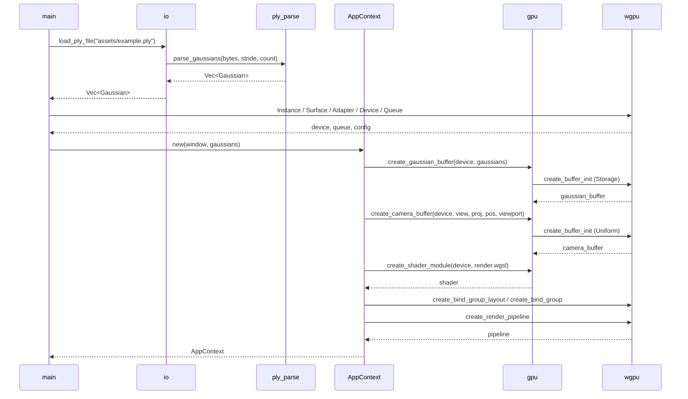
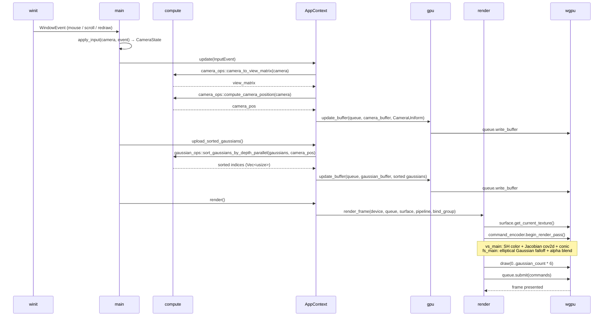

# Functional 3DGS Viewer

A cross-platform 3D Gaussian Splatting viewer built with Rust and wgpu, following functional programming principles (Data / Compute / Action separation).

## Features

- Cross-platform: macOS (Metal), Linux (Vulkan), Windows (DX12) — same codebase
- Functional architecture based on Eric Normand's data/calculation/action model
- Binary PLY file parsing (3DGS SH degree=3)
- Per-frame back-to-front depth sorting with Rayon parallel sort
- Jacobian-based 3D→2D covariance projection with elliptical Gaussian rendering
- Degree-3 Spherical Harmonics for view-dependent color evaluation
- Alpha blending via conic (2D Gaussian inverse) in WGSL
- Mouse drag orbit + scroll zoom camera control

## Architecture

Follows Eric Normand's **Data / Compute / Action** model:

| Layer | Rule | Examples |
|---|---|---|
| `data/` | Immutable structs, no behaviour | `Gaussian`, `CameraState`, `AppState` |
| `compute/` | Pure functions — no I/O, fully unit-testable | SH evaluation, depth sort, PLY parsing |
| `action/` | Side-effecting functions (I/O, GPU writes) | file loading, buffer uploads, render pass |

```
src/
├── data/          # Immutable data structures (Gaussian, CameraState, AppState)
├── compute/       # Pure functions — no side effects, fully testable
│   ├── camera_ops.rs      # view matrix, orbit, zoom
│   ├── gaussian_ops.rs    # depth sort, covariance, LOD filter
│   └── ply_parse.rs       # binary PLY → Vec<Gaussian>
├── action/        # Side-effecting functions (I/O, GPU, rendering)
│   ├── io.rs              # file loading
│   ├── gpu.rs             # buffer creation and updates
│   └── render.rs          # render pass execution
├── shaders/
│   └── render.wgsl        # vertex: SH + Jacobian cov2d; fragment: conic alpha blend
└── main.rs        # Event loop and action orchestration
```

### Startup Sequence



### Per-Frame Sequence



## Requirements

- Rust 1.75+
- A GPU with Metal / Vulkan / DX12 support

## Getting Started

### 1. Clone

```bash
git clone https://github.com/y30n9ju1v/rust-wgpu-based-functional-3dgs-viewer.git
cd rust-wgpu-based-functional-3dgs-viewer
```

### 2. Generate a dummy PLY (optional)

```bash
cd assets
python3 generate_dummy_ply.py   # outputs example.ply
cd ..
```

### 3. Run

```bash
cargo run --release
```

The viewer loads `assets/example.ply` on startup. Replace it with any 3DGS PLY file (SH degree=3, 62 floats per vertex).

To enable logging:

```bash
RUST_LOG=info cargo run --release
```

## Controls

Default window size: 1024 × 768.

| Input | Action |
|---|---|
| Left mouse drag | Orbit camera |
| Scroll wheel / trackpad | Zoom in / out |
| Close window | Exit |

## Dependencies

| Crate | Purpose |
|---|---|
| `wgpu` | Cross-platform GPU API (Metal / Vulkan / DX12 / WebGPU) |
| `winit` | Window and input handling |
| `glam` | Linear algebra (Vec3, Mat4, Quat) |
| `bytemuck` | Safe GPU buffer casting |
| `rayon` | Parallel depth sorting |
| `pollster` | Blocking async executor (avoids tokio conflict with winit) |
| `anyhow` | Error handling |

## PLY Format

The viewer expects binary little-endian PLY with the following 62 float properties per vertex:

```
x y z nx ny nz
f_dc_0 f_dc_1 f_dc_2
f_rest_0 … f_rest_44
opacity scale_0 scale_1 scale_2 rot_0 rot_1 rot_2 rot_3
```

`nx ny nz` (vertex normals) are parsed to maintain stride compatibility but are not used in rendering.

This matches the output of the [official 3DGS training code](https://github.com/graphdeco-inria/gaussian-splatting).

## License
